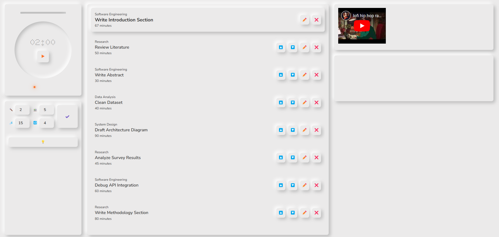

# Project Title

A web-based task management and productivity tool to manage and track tasks effectively with features such as timers, to-do lists, and more.

---

## Table of Contents

- [Project Title](#project-title)
  - [Table of Contents](#table-of-contents)
  - [Overview](#overview)
  - [Features](#features)
  - [Project Structure](#project-structure)
  - [Setup and Installation](#setup-and-installation)
    - [Prerequisites](#prerequisites)
    - [Steps](#steps)
  - [Running the Project](#running-the-project)
  - [Editing Tailwind CSS](#editing-tailwind-css)
  - [Screenshot](#screenshot)
  - [Contributing](#contributing)
  - [License](#license)

---

## Overview

This project is a web-based task management tool designed to help users stay productive by organizing their tasks and managing time efficiently. The application includes features such as timers, a to-do list, and customizable themes.

---

## Features

- **Timer Functionality**: Set and track time for tasks.
- **To-Do List**: Add, edit, and remove tasks.
- **Custom Themes**: Switch between light and dark modes.
- **Task Prioritization**: Reorganize tasks based on priority.
- **Interactive User Interface**: Clean and responsive design.

---

## Project Structure

```plaintext
public/
  css/
    style.css
  js/
    script.js
    theme.js
    timer.js
    todo.js
  index.html
src/
  style.css
.gitignore
package-lock.json
package.json
server.js
tailwind.config.js
tasks.json
timer.json
```

- **public/**: Contains the compiled CSS and JavaScript files along with the main HTML file.
- **src/**: Contains source files, including the main CSS file for Tailwind.
- **server.js**: The entry point for the Node.js server.
- **tasks.json & timer.json**: JSON files for storing task and timer data.
- **tailwind.config.js**: Configuration file for Tailwind CSS.

---

## Setup and Installation

### Prerequisites

- [Node.js](https://nodejs.org/) (v14 or later)
- [npm](https://www.npmjs.com/)

### Steps

1. Clone the repository:
   ```bash
   git clone <repository-url>
   cd <project-directory>
   ```
2. Install dependencies:
   ```bash
   npm install
   ```

---

## Running the Project

Start the server by running the following command:

```bash
node server.js <port (optional)>
```

The application will be accessible at `http://localhost:3000` by default.

---

## Editing Tailwind CSS

To make changes to the Tailwind CSS configuration, use the following command:

```bash
npx tailwindcss -i ./src/style.css -o ./public/css/style.css --watch
```

This will watch for changes in the source CSS file and update the compiled CSS file in the public directory.

---

## Screenshot



---

## Contributing

Contributions are welcome! Please fork this repository and submit a pull request with your changes.

---

## License

This project is licensed under the MIT License. See the LICENSE file for details.

