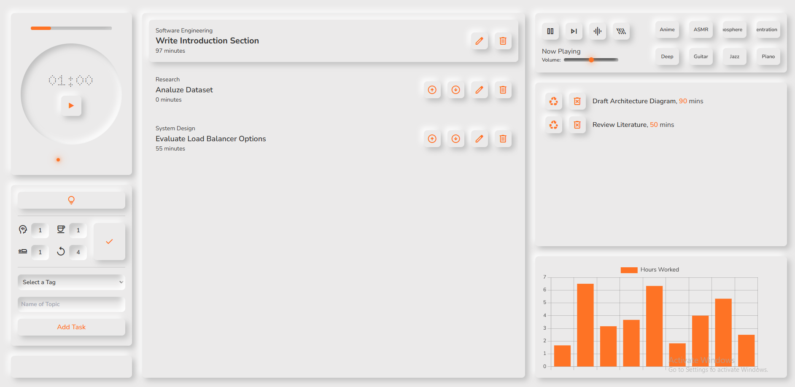
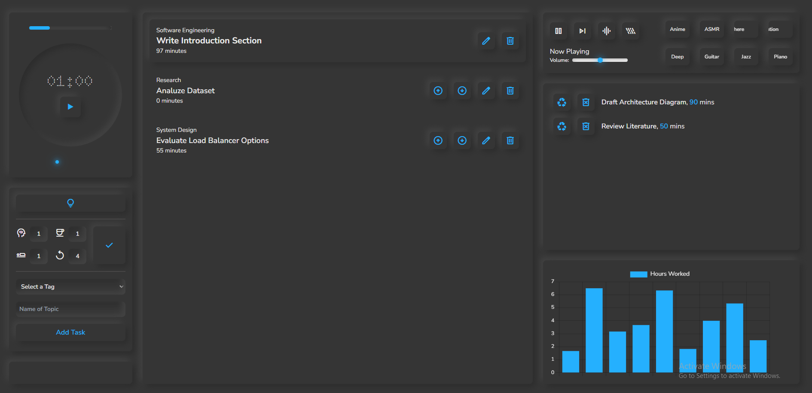

# Personal Pomodoro

A web-based task management and productivity tool to manage and track tasks effectively with features such as timers, to-do lists, music, progress tracking, and more.

---

## Table of Contents

- [Personal Pomodoro](#personal-pomodoro)
  - [Table of Contents](#table-of-contents)
  - [Overview](#overview)
  - [Features](#features)
  - [Project Structure](#project-structure)
  - [Setup and Installation](#setup-and-installation)
    - [Prerequisites](#prerequisites)
    - [Steps](#steps)
  - [Running the Project](#running-the-project)
  - [Editing Tailwind CSS](#editing-tailwind-css)
  - [Adding Music Playlists](#adding-music-playlists)
  - [Screenshot](#screenshot)
  - [Contributing](#contributing)
  - [License](#license)
  - [Next Expected Changes](#next-expected-changes)

---

## Overview

This project is a web-based task management tool designed to help users stay productive by organizing their tasks and managing time efficiently. The application includes features such as timers, a to-do list, music playback, progress tracking, and customizable themes.

---

## Features

- **Timer Functionality**: Set and track time for tasks.
- **To-Do List**: Add, edit, and remove tasks.
- **Custom Themes**: Switch between light and dark modes.
- **Task Prioritization**: Reorganize tasks based on priority.
- **Daily Progress Chart**: Track your daily activity and productivity visually.
- **Music Playback**:
  - Create playlists by adding folders with audio files to the `public/music` directory.
  - Supports background tracks like brown noise and rain noise with adjustable volume settings (0 -> 75% -> 50% -> 25% -> 10% -> 0).
- **State Change Notifications**: Get notifications when the timer transitions between states (focus, short break, or long break).
- **Archived Tasks**:
  - Permanently delete archived tasks or recycle them back into active tasks.
- **Interactive User Interface**: Clean and responsive design.
- **Next Expected Changes**: See the next set of features expected to be added to the project.

---

## Project Structure

```plaintext
public/
  css/
    style.css
  js/
    script.js
    theme.js
    timer.js
    todo.js
  music/
    <playlist-folder>/
      track1.mp3
      track2.mp3
  resources/
    brown-noise.mp3
    rain-noise.mp3
  index.html
src/
  style.css
.gitignore
package-lock.json
package.json
server.js
tailwind.config.js
tasks.json
timer.json
archived-task.json
history.json
```

- **public/**: Contains the compiled CSS and JavaScript files along with static assets such as music and resources.
  - **music/**: Add folders with audio tracks to create playlists.
  - **resources/**: Includes background tracks like brown noise and rain noise.
- **src/**: Contains source files, including the main CSS file for Tailwind.
- **server.js**: The entry point for the Node.js server.
- **tasks.json, timer.json, archived-task.json & history.json**: JSON files for personal data.
- **tailwind.config.js**: Configuration file for Tailwind CSS.

---

## Setup and Installation

### Prerequisites

- [Node.js](https://nodejs.org/) (v14 or later)
- [npm](https://www.npmjs.com/)

### Steps

1. Clone the repository:
   ```bash
   git clone <repository-url>
   cd <project-directory>
   ```
2. Install dependencies:
   ```bash
   npm install
   ```

---

## Running the Project

Start the server by running the following command:

```bash
node server.js <port (optional)>
```

The application will be accessible at `http://localhost:3000` by default.

---

## Editing Tailwind CSS

To make changes to the Tailwind CSS configuration, use the following command:

```bash
npx tailwindcss -i ./src/style.css -o ./public/css/style.css --watch
```

This will watch for changes in the source CSS file and update the compiled CSS file in the public directory.

---

## Adding Music Playlists

1. Navigate to the `public/music` directory.
2. Create a folder and add your audio tracks inside it. The folder will automatically be recognized as a playlist in the app.
3. Background sounds (brown noise, rain noise) are included in the `public/resources` directory and can be controlled with a button that toggles the volume between:
   - 0% → 75% → 50% → 25% → 10% → 0%.

---

## Screenshot




---

## Contributing

Contributions are welcome! Please fork this repository and submit a pull request with your changes.

---

## License

This project is licensed under the MIT License. See the LICENSE file for details.

---

## Next Expected Changes

- **Mobile Responsive**: Enhance the app to provide a seamless experience on mobile devices.
- **Functional Edit Button**: Implement functionality for the edit button to modify existing tasks.
- **Tag-Based Activity Tracking**: Introduce tracking and analysis based on task tags for better categorization.
- **Today's Activity**: Display a summary of activities completed on the current day.
- **Adding New Tag**: Allow users to create and assign new tags to tasks for better organization.

